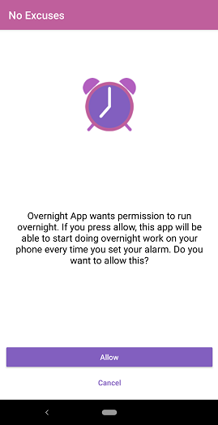

# No Excuses Alarm Clock
No Excuses Alarm Clock uses loud ringing, flashing lights, text-to-speech and guided meditations to wake the user up in the morning. It also locks the user out of their phone and forces them to get out of bed before they can unlock the phone and turn the alarm off. Because the alarm must be set by the user every night, linking with this app can be useful for detecting when a user is sleeping, allowing your app to trigger background tasks and services to run on the user's phone during the night.
# Rules
* Each app may only link one service at a time.
* The name of your linked service must begin with the package name of your app.
* Your app should avoid opening activities from the background, as this can prevent the alarm from ringing.
* Your background service should avoid intensive background operations.
* Always respect the user's privacy.
* Respect the phone - avoid draining the battery or using mobile data allowance.
* We reserve the right to blacklist your app from our linked services feature if we feel that these rules aren't being followed.
# Requesting Permission
To run overnight, your app must request permission to do so from the user.



Use the following code to request permission:
```java
//first, check if No Excuses is installed on the phone
PackageManager packageManager = getPackageManager();
try {
    if(packageManager.getPackageInfo("com.amvara.noexcusesalarmclock", 0) != null) {

        //start the No Excuses Permission Activity
        Intent intent = new Intent();
        intent.setComponent(new ComponentName("com.amvara.noexcusesalarmclock", "com.amvara.noexcusesalarmclock.LinkServicePermissionActivity"));
        //insert the name of your service below
        //your service name must begin with your app's package name
        intent.putExtra("service_name", "com.amvara.overnightapp.OvernightService");
        startActivityForResult(intent, NOEXCUSES_REQUEST_CODE);

    }
} catch (PackageManager.NameNotFoundException e) {
    e.printStackTrace();
}
```
You can see the result from this request in your Activity's onActivityResult method:
```java
@Override
protected void onActivityResult(int requestCode, int resultCode, @Nullable Intent data) {
    super.onActivityResult(requestCode, resultCode, data);

    if(requestCode == NOEXCUSES_REQUEST_CODE) {
        if(resultCode == RESULT_OK) {
            //Your app is now linked to No Excuses and will be notified of alarm events.
        } else {
            //The request failed. This may be because you provided an invalid service name or because the user declined the request.
        }
    }
}
```
# The Service
The linked service must be exported for the linking to work. It should look like this in your Manifest:
```xml
<service
    android:name=".OvernightService"
    android:enabled="true"
    android:exported="true" />
```
When an alarm event occurs, you'll receive it in your Service's onStartCommand method and you can interpret it with the following code:
```java
```
# Checking the Link
By referencing the No Excuses Content Provider, it's possible to tell if your app is currently linked. You should check this regularly, as it is possible for the user to revoke permission without your app being notified.
```java
//first, check if No Excuses is installed on the phone
PackageManager packageManager = getPackageManager();
try {
    if(packageManager.getPackageInfo("com.amvara.noexcusesalarmclock", 0) != null) {

        //query the No Excuses Content Provider
        ContentResolver contentResolver = getContentResolver();
        //there is no need to include any arguments in the query
        Cursor cursor = contentResolver.query(Uri.parse("content://com.amvara.noexcusesalarmclock.linkedservices"), null, null, null, null);
        if(cursor.getCount() == 0) {
            //your app is not linked
        } else {
            //your app is linked
            cursor.moveToFirst();
            //get the name of the linked service
            String name = cursor.getString(cursor.getColumnIndex("serviceName"));
        }

    }
} catch (PackageManager.NameNotFoundException e) {
    e.printStackTrace();
}
```
# Removing the Link
The user can remove the link from within No Excuses Settings. The link will also be removed if the user logs out of No Excuses or clears the app data. Your app can also delete its own link using the No Excuses Content Provider.
```java
//first, check if No Excuses is installed on the phone
PackageManager packageManager = getPackageManager();
try {
    if(packageManager.getPackageInfo("com.amvara.noexcusesalarmclock", 0) != null) {

        //query the No Excuses Content Provider
        ContentResolver contentResolver = getContentResolver();
        //there is no need to include any arguments in the query
        int result = contentResolver.delete(Uri.parse("content://com.amvara.noexcusesalarmclock.linkedservices"), null, null);
        if(result == 0) {
            //The deletion failed. This is most likely because your app wasn't linked in the first place. 
        } else if(result == 1) {
            //Your app has been unlinked.
        }

    }
} catch (PackageManager.NameNotFoundException e) {
    e.printStackTrace();
}
```
# Contact
Contact us at contact@amvara.com if you have any questions.
